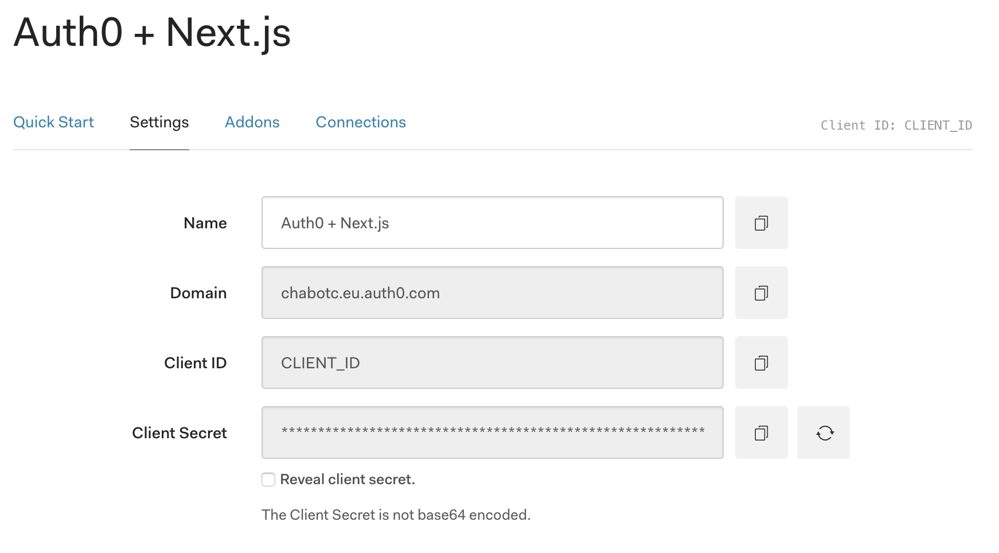
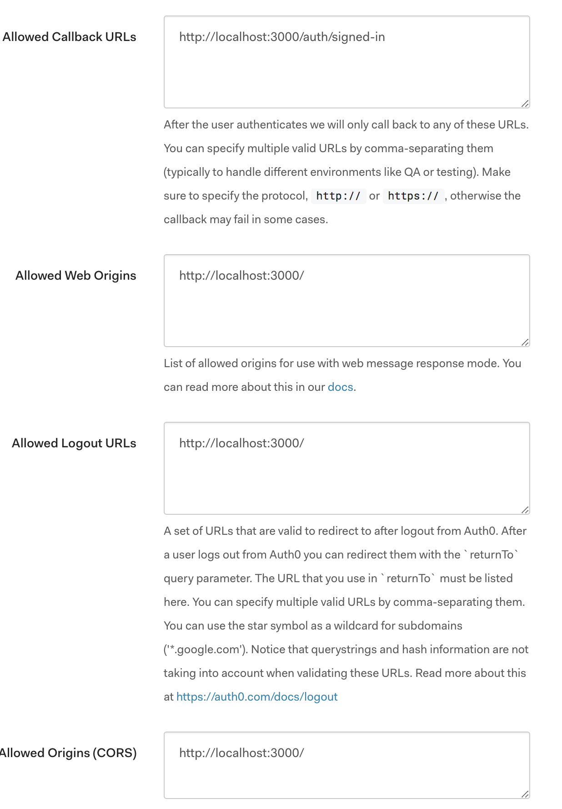
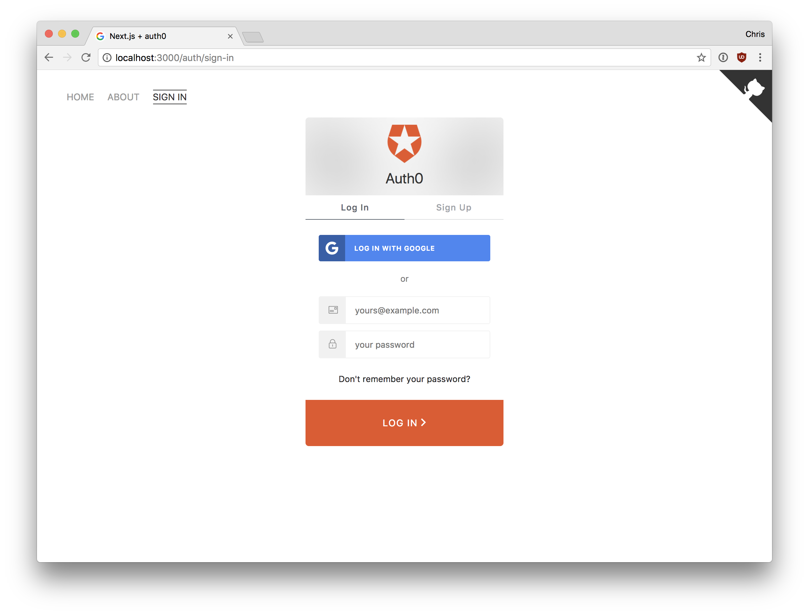
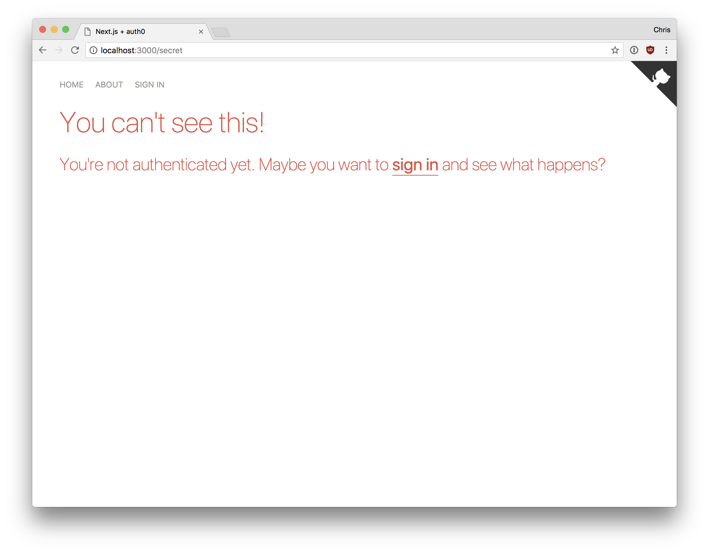

# Next.js + Auth0 Quickstart

## Before you get started

This guide walks you through setting up authentication and authorization in your Next.js apps with Auth0. If you are new to Auth0, check our [Overview](https://auth0.com/docs/overview). For a complete picture of authentication and authorization for all Single Page Applications, check our [SPA + API documentation](https://auth0.com/docs/architecture-scenarios/application/spa-api).

Auth0 uses OAuth 2. If you want to learn more about the OAuth flows used by Single Page Applications, read about [Authentication for Client-side Web Apps](https://auth0.com/docs/client-auth/current/client-side-web).

## Get Your Application Keys

During the signup flow with Auth0, you've already created a new client. If this isn't your first app, click the New Client button in the [dashboard](https://manage.auth0.com/#/) to create a new one and select "Single Page App" in the next window.

When you use Auth0 in your app it needs some details to connect it to this client, these can be found your clients Settings tab in the [Auth0 dashboard](https://manage.auth0.com/#/).

You'll need the following information from this screen:

* **Client ID**
* **Domain**

Copy the file `config.sample.json` at the root folder, rename it to `config.json`, and enter the Client ID and Domain there.



## Configure Callback URLs

The callback URL is a URL in your application where Auth0 redirects the user after they have authenticated.

You need to whitelist the callback URL for your app in the Allowed Callback URLs field in your Client Settings. If you do not set any callback URL, your users will see a mismatch error when they log in.

If you're following along with this sample app, the callback URL should be set to `http://localhost:3000/auth/signed-in`.

And finally set Allowed Web Origins, Allowed Logout URLs and Allowed Origins (CORS) all to `http://localhost:3000/`

At this point your configuration should look like This



## Install auth0-lock

Lock is an embeddable and highly configurable login form that makes it easy for your users to authenticate using a selected connection. Lock will automatically handle most of the details involved in creating and authenticating users and super quick to add to your app. To read more about Lock see the [Lock Documentation](https://auth0.com/docs/libraries/lock/v10).

In this example we'll use the JSON Web Token that Auth0 returns to get the full profile information and token expiration, the jwt-decode package can be used to decode this.

```
# installation with npm
npm install --save auth0-lock jwt-decode

# installation with yarn
yarn add auth0-lock jwt-decode
```

## Create an Authentication Service

Create a function to create the lock service. You can give the service any name. In the examples below, the function is `getLock` and the filename is `lock.js`.

When creating the instance of the lock object, you can specify the following:

* Configuration for your client and domain
* Response type, to show that you need a user's access token and an ID token after authentication
* Audience and scope, which specify that authentication must be OIDC-conformant
* The URL where you want to redirect your users after authentication.

In this tutorial, the route is `http://localhost:3000/auth/signed-in`, which is implemented in the Add a Callback Component step.


```
// auth/lock.js

import { setSecret } from './auth'

import uuid from 'uuid'

const getLock = (options) => {
  const config = require('../config.json')
  const Auth0Lock = require('auth0-lock').default
  return new Auth0Lock(config.AUTH0_CLIENT_ID, config.AUTH0_CLIENT_DOMAIN, options)
}

const getBaseUrl = () => `${window.location.protocol}//${window.location.host}`

const getOptions = (container) => {
  const secret = uuid.v4()
  setSecret(secret)
  return {
    container,
    closable: false,
    auth: {
      responseType: 'token id_token',
      audience: 'https://your.service.auth0.com/userinfo',
      redirectUrl: `${getBaseUrl()}/auth/signed-in`,
      params: {
        scope: 'openid profile email',
        state: secret
      }
    }
  }
}

export const show = (container) => getLock(getOptions(container)).show()
export const logout = () => getLock().logout({ returnTo: getBaseUrl() })
```

To use the Lock service in both Next.js's client and server modes we'll use some boilerplate code that extracts the access and JWT tokens and stores these using localStorage and Cookies. This also implements the shared secret using the uuid package to prevent against replay attacks.

```
// auth/auth,js

import jwtDecode from 'jwt-decode'
import Cookie from 'js-cookie'

const getQueryParams = () => {
  const params = {}
  window.location.href.replace(/([^(?|#)=&]+)(=([^&]*))?/g, ($0, $1, $2, $3) => {
    params[$1] = $3
  })
  return params
}

export const extractInfoFromHash = () => {
  if (!process.browser) {
    return undefined
  }
  const {id_token, state} = getQueryParams()
  return {token: id_token, secret: state}
}

export const setToken = (token) => {
  if (!process.browser) {
    return
  }
  Cookie.set('user', jwtDecode(token))
  Cookie.set('jwt', token)
}

export const unsetToken = () => {
  if (!process.browser) {
    return
  }
  Cookie.remove('jwt')
  Cookie.remove('user')
  Cookie.remove('secret')

  // to support logging out from all windows
  window.localStorage.setItem('logout', Date.now())
}

export const getUserFromServerCookie = (req) => {
  if (!req.headers.cookie) {
    return undefined
  }
  const jwtCookie = req.headers.cookie.split(';').find(c => c.trim().startsWith('jwt='))
  if (!jwtCookie) {
    return undefined
  }
  const jwt = jwtCookie.split('=')[1]
  return jwtDecode(jwt)
}

export const getUserFromLocalCookie = () => {
  return Cookie.getJSON('user')
}

export const setSecret = (secret) => Cookie.set('secret', secret)

export const checkSecret = (secret) => Cookie.get('secret') === secret
```

## Provide a Login Control

Provide a component with controls for the user to log in and log out.

```
// pages/auth/sign-in.js

import React from 'react'

import defaultPage from '../../hocs/defaultPage'
import { show } from '../../utils/lock'

const CONTAINER_ID = 'put-lock-here'

class SignIn extends React.Component {
  componentDidMount () {
    show(CONTAINER_ID)
  }
  render () {
    return <div id={CONTAINER_ID} />
  }
}

export default defaultPage(SignIn)
```

Which will render the login component:



Next implement a page that deals with the Authentication flow redirect, in this page we'll check and capture the access token and JWT information on success and redirects to the index page:

```
// auth/signed-in.js

import React, { PropTypes } from 'react'
import Router from 'next/router'

import { setToken, checkSecret, extractInfoFromHash } from '../../utils/auth'

export default class SignedIn extends React.Component {
  static propTypes = {
    url: PropTypes.object.isRequired
  }

  componentDidMount () {
    const {token, secret} = extractInfoFromHash()
    if (!checkSecret(secret) || !token) {
      console.error('Something happened with the Sign In request')
    }
    setToken(token)
    Router.push('/')
  }
  render () {
    return null
  }
}
```


And add a page to allow the user to sign out:

```
import React from 'react'

import { unsetToken } from '../../utils/auth'
import { logout } from '../../utils/lock'

export default class SignOff extends React.Component {
  componentDidMount () {
    unsetToken()
    logout()
  }
  render () {
    return null
  }
}
```

With Next.js the index page is rendered on the sever, so add a check there to see if the user is authenticated, and chose which content to display based on this:

```
// pages/index.js

import React, { PropTypes } from 'react'
import Link from 'next/link'

import defaultPage from '../hocs/defaultPage'

const SuperSecretDiv = () => (
  <div>
    This is a super secret div.
    <style jsx>{`
      div {
        background-color: #ecf0f1;
        box-shadow: 0 1px 3px rgba(0,0,0,0.12), 0 1px 2px rgba(0,0,0,0.24);
        border-radius: 2px;
        padding: 10px;
        min-height: 100px;
        display: flex;
        align-items: center;
        justify-content: center;
        color: #333;
        text-align: center;
        font-size: 40px;
        font-weight: 100;
        margin-bottom: 30px;
      }
    `}</style>
  </div>
)

const createLink = (href, text) => (
  <a href={href}>
    {text}
    <style jsx>{`
      a {
        color: #333;
        padding-bottom: 2px;
        border-bottom: 1px solid #ccc;
        text-decoration: none;
        font-weight: 400;
        line-height: 30px;
        transition: border-bottom .2s;
      }

      a:hover {
        border-bottom-color: #333;
      }
    `}</style>
  </a>
)

const Index = ({ isAuthenticated }) => (
  <div>
    {isAuthenticated && <SuperSecretDiv />}
    <div className='main'>
      <h1>Hello, friend!</h1>
      <p>
        This is a super simple example of how to use {createLink('https://github.com/zeit/next.js', 'next.js')} and {createLink('https://auth0.com/', 'Auth0')} together.
      </p>
      {!isAuthenticated && (
        <p>
          You're not authenticated yet. Maybe you want to <Link href='/auth/sign-in'>{createLink('/auth/sign-in', 'sign in')}</Link> and see what happens?
        </p>
      )}
      {isAuthenticated && (
        <p>
          Now that you're authenticated, maybe you should try going to our <Link href='/secret'>{createLink('/secret', 'super secret page')}</Link>!
        </p>
      )}
    </div>
    <style jsx>{`
      .main {
        max-width: 750px;
        margin: 0 auto;
        text-align: center;
      }

      h1 {
        font-size: 40;
        font-weight: 200;
        line-height: 40px;
      }

      p {
        font-size: 20px;
        font-weight: 200;
        line-height: 30px;
      }
    `}</style>
  </div>
)

Index.propTypes = {
  isAuthenticated: PropTypes.bool.isRequired
}

export default defaultPage(Index)
```

Any protected resources should check if the user is authenticated as well, and either display the content or an access denied based on this status:

```
// pages/secret.js

import React, { PropTypes } from 'react'
import styled from 'styled-components'

import securePage from '../hocs/securePage'

const Content = styled.p`
  font-size: 20px;
  font-weight: 200;
  line-height: 30px;
`

const Secret = ({ loggedUser }) => (
  <div>
    <Content>
      Hi <strong>{loggedUser.email}</strong>. This is a super secure page! Try loading this page again using the incognito/private mode of your browser.
    </Content>
  </div>
)

Secret.propTypes = {
  loggedUser: PropTypes.object.isRequired
}

export default securePage(Secret)
```

Which will look like this if the user is not authenticated:


**Note**: Next.js exposes all cookies and environment variables to the client. This means the user could extract the access token and make API calls outside of the application using their authorization.

If you wish to prevent this you will have to run a custom express server to store the shared secret access token server side only. This also applies fore any other variables you wish to prevent from being exposed to the client.

## User Profile

By requesting the 'openid profile email' scope in `auth/lock.js` the JWT on succesful authentication will contain the complete user profile information, by storing this in a cookie as this example does, it's available to both the server and client side, and can be retrieved using the `getUserFromLocalCookie` function.
